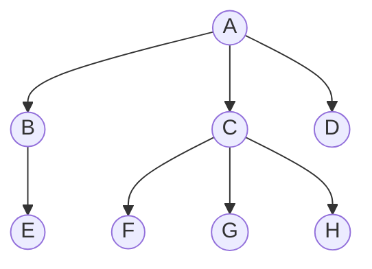
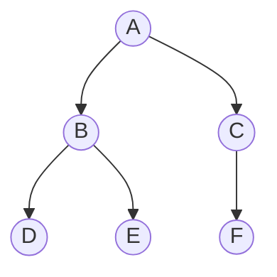
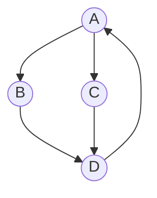
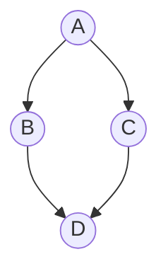

# Data Structures: Tree Identification Worksheet
Name: ___________________________  Date: ________________

**Instructions:** Carefully examine each of the 5 diagrams below. For each diagram, answer the following four questions:

1. Is it a tree? (Yes / No)
2. Is it a binary tree? (Yes / No)
3. Which nodes are leaves? (List their letters, or write "N/A" if not applicable)
4. What is the depth of the tree? (Assume the root is at depth 0. Write "N/A" if not applicable)

## Diagram 1

**Questions:**

- Is it a tree? ________
- Is it a binary tree? ________
- Which nodes are leaves? ________________________
- What is the depth? ________

## Diagram 2

**Questions:**

- Is it a tree? ________
- Is it a binary tree? ________
- Which nodes are leaves? ________________________
- What is the depth? ________

## Diagram 3

**Questions:**

- Is it a tree? ________
- Is it a binary tree? ________
- Which nodes are leaves? ________________________
- What is the depth? ________

## Diagram 4

**Questions:**

- Is it a tree? ________
- Is it a binary tree? ________
- Which nodes are leaves? ________________________
- What is the depth? ________

## Diagram 5

**Questions:**
- Is it a tree? ________
- Is it a binary tree? ________
- Which nodes are leaves? ________________________
- What is the depth? ________

# 🛑 TEACHER ANSWER KEY 🛑

**Diagram 1 (General Tree)**
- Is it a tree? Yes
- Is it a binary tree? No (Nodes A and C have 3 children, exceeding the maximum of 2).
- Which nodes are leaves? D, E, F, G, H (They have no children).
- What is the depth? 2 (A is 0; B,C,D are 1; E,F,G,H are 2).

**Diagram 2 (Binary Tree)**
- Is it a tree? Yes
- Is it a binary tree? Yes (Every node has at most 2 children).
- Which nodes are leaves? D, E, F
- What is the depth? 2

**Diagram 3 (Linear List / Degenerate Tree)**
- Is it a tree? Yes
- Is it a binary tree? Yes (Every node has at most 1 child, which safely satisfies the "at most 2" rule).
- Which nodes are leaves? E
- What is the depth? 4

**Diagram 4 (Cyclic Graph / Loop)**
- Is it a tree? No (It contains a cycle/loop: D points back to A, and D has two parents).
- Is it a binary tree? No (N/A)
- Which nodes are leaves? N/A (Because of the loop, the standard definition of tree leaves doesn't apply cleanly, though technically no node lacks an outgoing edge).
- What is the depth? N/A (Infinite/Undefined due to the cycle).

**Diagram 5 (Directed Acyclic Graph / DAG)**
- Is it a tree? No (Node D has two parents: B and C. In a valid tree, every node except the root must have exactly one parent).
- Is it a binary tree? No (N/A)
- Which nodes are leaves? N/A (Not a tree, but D has no outgoing edges).
- What is the depth? N/A (Not a tree).
