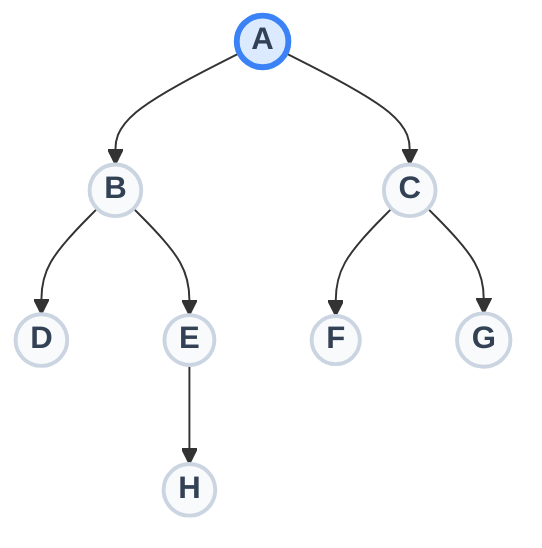

# Data Structures: Tree Terminology

Name: ___________________________  Date: ________________

## The Visual Reference Tree

_Use this diagram to follow along with the lecture and answer the questions._

### 1. The Building Blocks

- ___________ : The circles in the diagram. These contain the actual data or values being stored.

- ___________ : The lines connecting the circles. These represent the relationships or links between the data.

### 2. Family Relationships

_Think of a tree like a family tree chart._

- ___________ : A node that has nodes below it. (Example: Node B is the ___________ of Nodes D and E).

- ___________ : A node that descends directly from another node. (Example: Node F is the ___________ of Node C).

- ___________ : Nodes that share the exact same parent. (Example: Nodes D and E are ___________).

### 3. Types of Nodes

- ___________ : The single top element of the tree. It is the only node in the tree that has no parent. (Example: Node A).

- ___________ (External Node): A node with absolutely zero children. It is the "end of the line." (Examples: Nodes D, F, G, and H).

- ___________ Node: Any node that has at least one child. (Examples: Nodes A, B, C, and E).

### 4. Measuring the Tree

- ___________ : The sequence of nodes and edges connecting a node to a descendant.

- ___________ : How many steps (edges) it takes to get from the Root to a specific node.

    - The Root is always at Depth _____.

    - Node C is at Depth _____.

    - Node H is at Depth _____.

## 🧠 Quick Check for Understanding

_(Try these before we review them as a class!)_

1. Look at Node E. Is it an Internal Node or a Leaf?

2. Who is the parent of Node G?

3. List all the siblings of Node C:

4. What is the depth of Node D?

